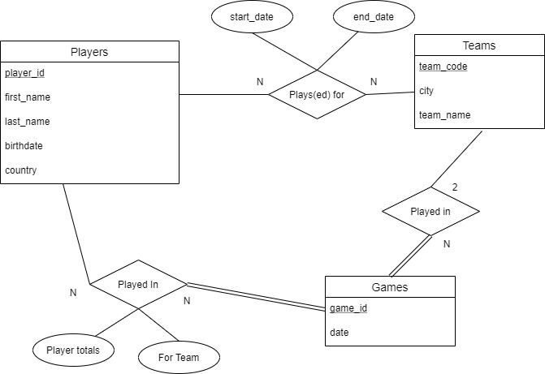

NBA SQL for 2010-11 to 2019-20 seasons
=

Purpose
-
The SQL scripts included here can be used to produce an SQL database containing boxscores and basic player & team info for the 2010-11 to 2019-20 NBA seasons.

All data was retrieved from the stats.nba.com api using the [nba\_api client](www.github.com/swar/nba_api).
The data may be incomplete and is not necessarily correct. 

The purpose of this project was for me to practice database design and SQL querying.

Install
-
This databse can be produced locally by reading `database_insert.sql` into an SQL database, assuming all of the `insert_*.sql` scripts are contained within the same directory.

Usage
-
See the `sample_query*.sql` scripts for ideas about how you might use this database.

# ER-Model
Note: The `start_date` and `end_date` attributes of the *"Plays(ed) for"* relation are meant to represent a players time **signed** to a team, although due to difficulties in aquiring this data, the `start_date` and `end_date` have instead been derived from each player's first and last games played with each team.

